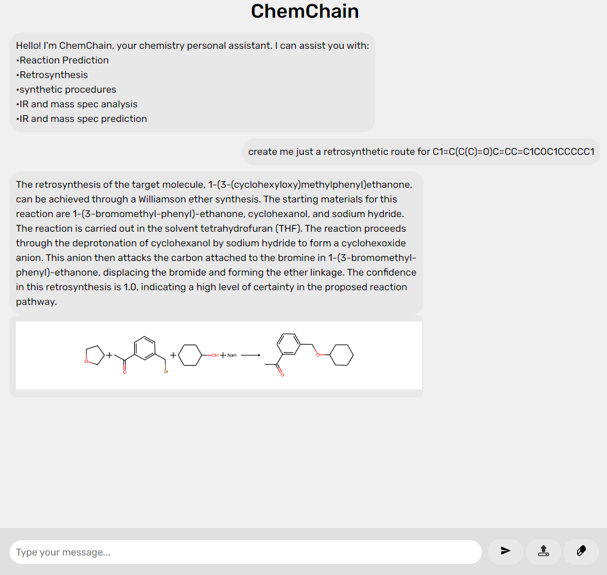
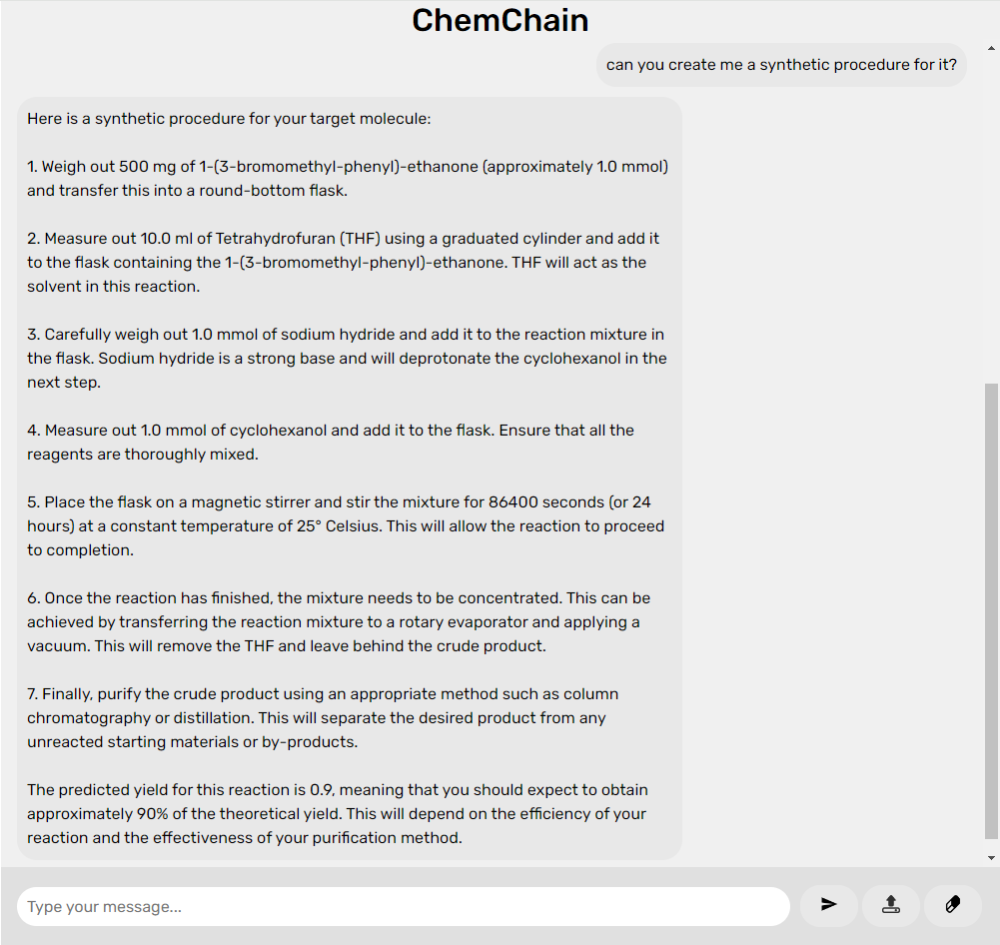
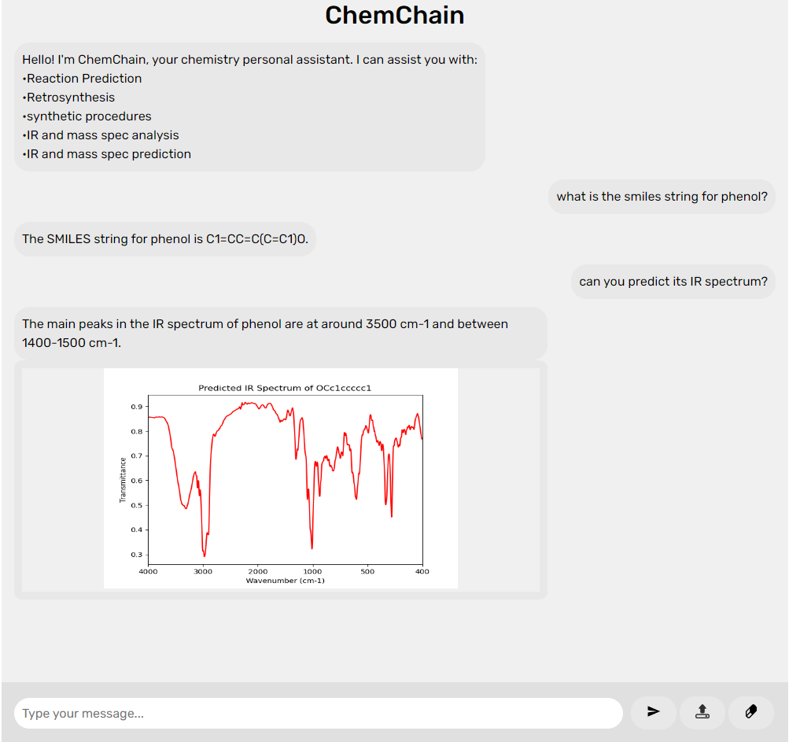

# ChemChain - an AI agent with access to multiple chemistry tools

ChemChain is an AI agent designed to provide access to a wide range of chemistry tools and resources. It leverages the power of artificial intelligence and machine learning to assist chemists in there work. It is built on a flask app and uses langchain/openai for the backbone of the agent and IBMrxn for some of the tools.

**Note:** Some of the tools are still under development and may not be fully functional as they require models which are trained on restricted data.

### Features

- Retrosynthesis
- Reaction prediction
- synthetic procedures
- IR Spectra prediction
- IR spectra analysis
- molecular drawing

## Examples

<div style="display: flex;">
  <center>
  
  
  
  </center>
</div>
Above shows three examples of chemchain in action with different responses.

## Installation
```bash
# Clone the repository
git clone https://github.com/lewmas1/ChemChain.git

# Change directory to the project folder
cd ChemChain

# Install dependencies (if applicable)
pip install -r requirements.txt
```
**IMPORTANT:** You must then add your own IBMrxn Keys and openAI api keys where appropriate to make the agent and tools function.
## Usage

Run the flask app by running `app.py` which should allow you to view the app on any browser and interact with the agent.

## License
[MIT](https://choosealicense.com/licenses/mit/)

## Authors
lewmas1